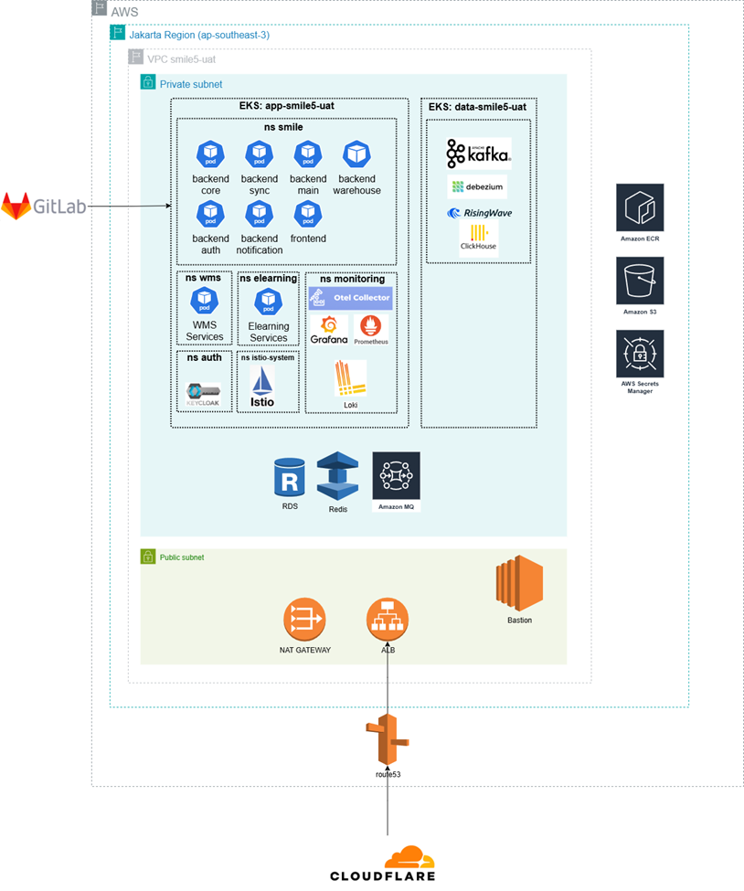

# SMILE Technical Overview

## Table of Contents
- [Purpose](#purpose)
- [Scope](#scope)
- [System Architecture Overview](#system-architecture-overview)
- [Technology Stack](#technology-stack)
- [Data Pipeline Architecture](#data-pipeline-architecture)
- [Infrastructure Requirements](#infrastructure-requirements)
- [Scalability Considerations](#scalability-considerations)
- [Security Overview](#security-overview)
- [Dependencies & External Integrations](#dependencies--external-integrations)

---

## Purpose

This document serves as a high-level technical reference for technical leads, developers, system integrators, and external evaluators. It provides an overview of SMILE’s architecture, technology stack, data pipeline, infrastructure, and operational considerations.

---

## Scope

This document covers the major technical components of the SMILE platform, including:
- Frontend and backend architecture
- Data pipeline and analytics
- Infrastructure and deployment considerations

Detailed low-level code documentation and API specifications are intentionally excluded and maintained in separate technical references.

---

## System Architecture Overview

The SMILE platform is designed as a modular, cloud-native system consisting of frontend applications, backend services, and a real-time data pipeline.

For detailed system architecture and deployment information, please refer to the **Cloud Infrastructure and Deployment** document.

---

## Technology Stack

| Layer | Technology / Framework | Description |
|------|------------------------|-------------|
| Frontend Web | React.js, Next.js | Single Page Application (SPA) with responsive user interface |
| Backend | Bun, Hono | Bun as backend runtime and Hono as backend framework |
| Language Translation | Tolgee | Dynamic multi-language support based on user preference |
| Mobile Frontend | React Native | Cross-platform mobile application development |
| Database | MySQL (OLTP), ClickHouse (OLAP) | Transactional and analytical data processing |
| Authentication | Keycloak, OAuth2 | Identity and access management |
| Data Pipeline | Pentaho, Debezium, Kafka, dbt, RisingWave | Data scheduling and real-time data streaming |
| Dashboard | Metabase | Data visualisation and analytics |
| Storage | MinIO | File storage, caching, and backup |
| Monitoring | Prometheus, Elastic APM, Grafana, OpenTelemetry | Metrics, tracing, and observability |
| Message Queue | RabbitMQ | Asynchronous messaging |
| Cache | Redis | In-memory caching for performance optimisation |
| Notification | Firebase | Email and WhatsApp notifications |
| DevOps | Jenkins, GitLab | CI/CD automation |
| Infrastructure | Kubernetes, Docker, AWS, Terraform, Ansible, OpenShift | Container orchestration and infrastructure management |

---

## Data Pipeline Architecture

The SMILE data pipeline supports both batch and real-time data processing to enable dashboards and reporting services.

For detailed data pipeline architecture and implementation, please refer to the **Data Streaming Mechanism** document.

---

## Infrastructure Requirements

SMILE is deployed on cloud infrastructure using containerised services and managed cloud resources.

For detailed infrastructure specifications and environment setup, please refer to the **SMILE Cloud Infrastructure** document.

---

## Scalability Considerations

The SMILE platform is designed with scalability in mind:
- Stateless backend services to enable horizontal scaling
- Use of Redis caching to reduce database load
- Fully containerised deployment using Kubernetes
- Asynchronous job processing via message queues or worker services
- Database indexing and performance tuning
- Kubernetes Horizontal Pod Autoscaler (HPA)
- Cluster Autoscaler on Amazon EKS

---

## Security Overview

Key security considerations include:
- Authentication and authorisation via Keycloak and OAuth2
- Enforced HTTPS for all external communications
- Secure secrets management using environment variables or secret managers
- Encryption of sensitive data at rest and in transit
- AWS Web Application Firewall (WAF)
- AWS GuardDuty for threat detection

---

## Dependencies & External Integrations

| Service | Purpose | Integration |
|--------|---------|-------------|
| Firebase | Notification Service | Cloud Messaging |
| Sentry | Application Monitoring | Error Monitoring & Tracing |
| Expo | Mobile Development & Testing | Expo SDK, Expo Go, Build Service |

---
